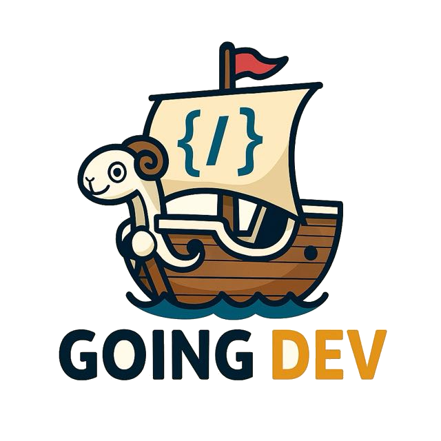
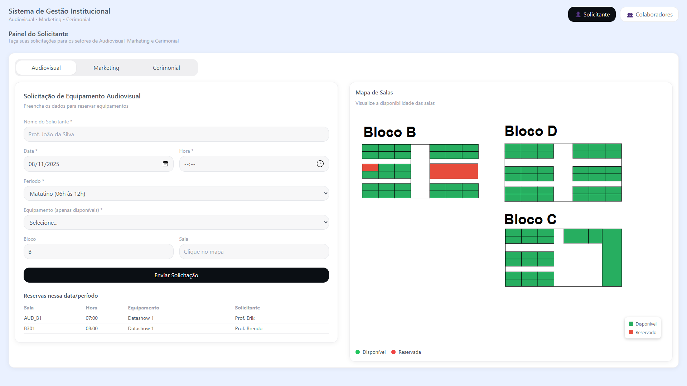
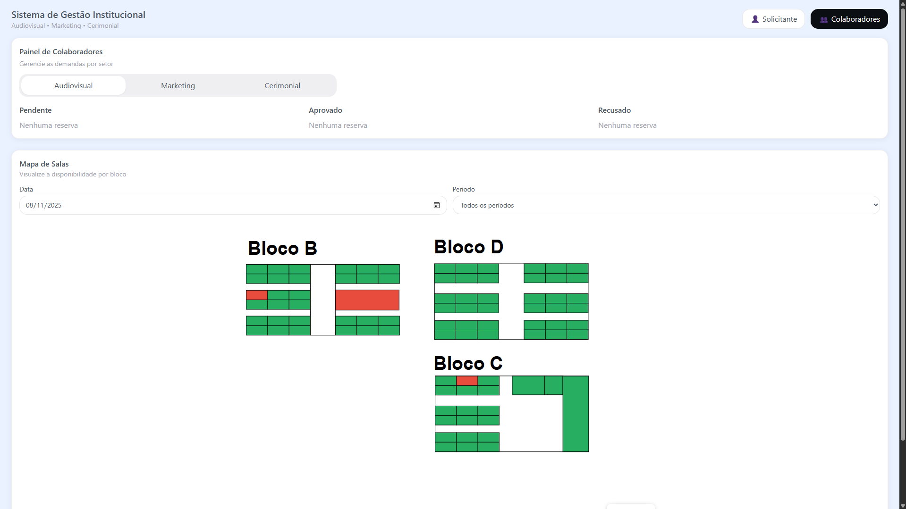

<p align="center">
  
</p>

# 💻 Going Dev

Aplicação **web** desenvolvida com **React + TypeScript + Vite**. O **Going Dev** é um projeto-base para estudos e prototipagem rápida de interfaces modernas, com foco em organização, padronização e DX.

---

## 🚀 Objetivo

Aplicar os principais conceitos de **desenvolvimento frontend com React e Vite**, incluindo:

* Estruturação de projeto com **Vite**
* Componentização e **reutilização** de UI
* Gerenciamento de estado com **React Hooks**
* Padronização com **TypeScript**, **ESLint** e **Prettier**
* (Opcional) **React Router** para navegação entre páginas
* Boas práticas de organização de pastas e assets

---

## 🧩 Funcionalidades

* 🏠 **Home:** tela inicial com componentes de exemplo
* 🧱 **Componentes Reutilizáveis:** botões, cards e helpers de layout
* 🧭 **Rotas (opcional):** páginas de exemplo (Sobre/Detalhes)
* 🔎 **Linting e Formatação:** configuração de ESLint/Prettier para padronizar código
* 📦 **Build e Preview:** scripts prontos para desenvolvimento e produção

---

## 🖼️ Telas Principais

|            Painel do Solicitante            |              Painel de Colaboradores            |
| :-----------------------------------------: | :---------------------------------------------: |
|            |             |


---

## 🗂️ Estrutura de Pastas

```
GOING_DEV/
│
├── src/
│   ├── assets/                # Ícones, imagens, fontes
│   ├── components/            # Componentes reutilizáveis de UI
│   ├── pages/                 # Páginas (se usar React Router)
│   ├── styles/                # Estilos globais / CSS Modules
│   ├── App.tsx                # Raiz da aplicação
│   └── main.tsx               # Ponto de entrada (Vite)
│
├── public/                    # Arquivos estáticos
├── index.html                 # HTML principal
├── package.json               # Dependências e scripts
├── tsconfig.json              # Configuração TypeScript
├── vite.config.ts             # Configuração do Vite
├── eslint.config.js           # Regras de lint (opcional)
└── README.md
```

---

## ⚙️ Instalação e Execução

```bash
# Clone o repositório
git clone https://github.com/seu-usuario/going-dev.git

# Acesse a pasta
cd going-dev

# Instale as dependências
npm install

# Ambiente de desenvolvimento
npm run dev
# Acesse em http://localhost:5173

# Build de produção
npm run build

# Pré-visualização do build
npm run preview
```

---

## 🛠️ Tecnologias Utilizadas

* **React** — Biblioteca principal de UI
* **Vite** — Bundler e dev server rápidos
* **TypeScript** — Tipagem estática
* **ESLint + Prettier** — Padronização de código
* (Opcional) **React Router** — Navegação entre páginas

---

## 🧠 Aprendizados

* Organização modular de componentes e páginas
* Uso de **hooks** (`useState`, `useEffect`, etc.)
* Padronização com **ESLint/Prettier** e tipos com **TypeScript**
* Pipeline de **build** e **preview** com Vite

---

## 👩‍💻 Equipe de Desenvolvimento

| Nome            | Função        |
| --------------- | ------------- |
| [Seu Nome Aqui] | Frontend / UI |
| [Outro Nome]    | Infra e Build |
| [Outro Nome]    | Documentação  |

> Atualize com os nomes e responsabilidades reais.

---

## 🏫 Contexto

Projeto de estudo/desenvolvimento com **React + Vite**. Ajuste esta seção caso o projeto esteja vinculado a uma disciplina, curso ou instituição.

---

## ⚠️ Observações

* Projeto com fins **educacionais** (ajuste conforme necessário).
* Substitua placeholders (imagens, nomes e links) pelos dados reais do seu repositório.

---
